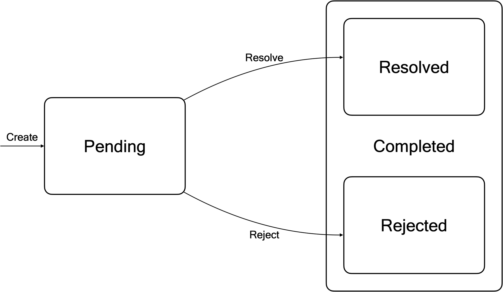

# Durable Promises

**Keywords**

*Promise, Future, Awaitable, Future Value, Write Once Register, Write Only Register, Single Assignment Container, Concurrency, Coordination*

**tl;dr** This repository is a specification for a Durable Promise API

20 years after the launch of Amazon Web Services, building reliable and scalable cloud-based applications is a challenge even for the most seasoned developers. Developing distributed applications is a dissonant mix of idioms, patterns, and technologies, feeling fragmented and inconsistent.
Yet developing traditional applications feels coherent and consistent. Developers who craft these applications have access to composable abstractions, functions & promises a.k.a async•await, and enjoy a delightful developer experience.

Even the largest traditional systems are built consistently from the smallest building blocks: functions & promises. Functions & promises are the foundational model to express concurrency and coordination. While their interpretations vary across languages and runtimes, the ideas are the same.

## Promises

A **promise**, also called future, awaitable, or deferred is a representation of a future value. A promise is either pending or completed, that is, resolved or rejected: A promise is pending, signaling that the value is not yet available or completed, signaling success or failure.



A promise is a coordination primitive: In a typical scenario, a downstream function execution creates a promise and awaits its completion. An upstream function execution either resolves or rejects the promise. On completion, the downstream execution resumes with the value of the promise. 


## Adding Durability

Recently, durable functions a.k.a durable executions have emerged as an abstraction for building distributed systems. Durable functions are functions with strong execution guarantees. Traditional, that is, volatile functions are bound to a single runtime. If the runtime crashes, any volatile function execution ceases to exist. Durable function executions are not bound to a runtime. If the runtime crashes, a durable function execution is simply rescheduled on a different runtime.

Durable promises are the counterpart to durable functions. Durable promises have identity and state that is not bound to a single runtime. Based on durable promises you can compose reliable and scalable distributed systems across heterogenous technology stacks.

## Application Programming Interface (API)

Logically, the Application Programming Interface (API) is divided in two parts, the Downstream API and the Upstream API.

## Downstream API

- **Create**

  A downstream component may create a promise

  ```
  Create(promise-id, idempotence-key, param, timeout)
  ```

- **Cancel**

  A downstream component can cancel an existing promise

  ```
  Cancel(promise-id, idempotence-key, value)
  ```

## Upstream API

- **Resolve**

  An upstream component can resolve an existing promise, signaling success

  ```
  Resolve(promise-id, idempotence-key, value)
  ```


- **Reject**

  An upstream component can reject a promise, signalling failure

  ```
  Reject(promise-id, idempotence-key, value)
  ```

# Idempotence

When creating, resolving, or rejecting a Durable Promise, use an idempotency key. An idempotency key is a client generated value which the server uses to recognize a duplicated request.

TBD